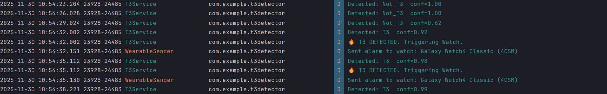

# T3 Alarm Detector System (Phone + Watch)

This project is an Android-based safety system designed to detect **T3 Fire Alarm patterns** (Temporal 3) using on-device Machine Learning (TensorFlow Lite). When the alarm pattern is detected by the phone, it automatically triggers a strong haptic vibration alert on a paired Samsung Galaxy Watch 4 (Wear OS).




## 📂 Project Structure

The project is organized into three main components:

````markdown
T3Detector/
├── app/                  # (Phone Module) - Audio recording, Pre-processing, Inference, Notification Sender
│   ├── src/main/java/com/example/t3detector/
│   │   ├── service/      # AudioDetectionService.kt, WearableSender.kt
│   │   ├── audio/        # MelExtractor.kt (DSP logic)
│   │   ├── tflite/       # TfliteHelper.kt (Model inference)
│   │   └── ui/           # MainActivity.kt
│   └── src/main/assets/  # Contains t3_detector_cnn.tflite
│
├── alarm/                # (Watch Module) - Listens for trigger, Vibrates
│   ├── src/main/java/com/example/t3detector/presentation/
│   │   └── WatchListenerService.kt  # Receives message, triggers vibration
│   └── src/main/AndroidManifest.xml
│
└── ml_training/          # (Machine Learning)
    └── T3_Audio_Classification.ipynb  # Jupyter Notebook for model training
````


## 🧠 Part 1: Machine Learning Model (`.ipynb`)

Before running the app, you need a trained TensorFlow Lite model. The provided Jupyter Notebook handles dataset generation, training, and conversion.

### 1. Prerequisites
* Python 3.8+
* Jupyter Notebook or Google Colab
* Libraries: `tensorflow`, `librosa`, `numpy`, `soundfile`, `audiomentations`

### 2. Steps to Train
1.  Open `T3_Audio_Classification.ipynb`.
2.  **Dataset Generation:** The notebook synthesizes T3 alarm sounds (augmenting a base sample) and downloads the UrbanSound8K dataset for "negative" (non-alarm) samples.
3.  **Preprocessing:** Converts audio into **Mel Spectrograms** (64 mel bins x 94 time frames).
4.  **Training:** Trains a Convolutional Neural Network (CNN) to classify inputs as T3 or Not\_T3.
5.  **Export:** The notebook converts the Keras model to `t3_detector_cnn.tflite`.

### 3. Deployment
1.  Download the generated `t3_detector_cnn.tflite` file.
2.  Place it in the Phone module's assets folder: `app/src/main/assets/t3_detector_cnn.tflite`

---

## 📱 Part 2: Android App Setup (Phone & Watch)

### Prerequisites
* **Android Studio** (Koala or newer recommended).
* **Samsung Galaxy Watch 4** (or any Wear OS 3+ device).
* **Android Phone** paired with the watch via the Galaxy Wearable App.
* **Developer Options** enabled on both Phone and Watch.

### ⚠️ Critical Configuration
To ensure the Phone and Watch can communicate, they must share the exact same **Application ID**.
* Open `app/build.gradle.kts` and check `applicationId` (e.g., `"com.example.t3detector"`).
* Open `alarm/build.gradle.kts` and ensure the `applicationId` matches exactly.

---

## 🚀 How to Run

This system requires two separate installation steps (one for the Watch, one for the Phone).

### Step 1: Install on Galaxy Watch 4
1.  **Enable Wireless Debugging on Watch:**
    * Settings > Developer Options > Enable **ADB Debugging**.
    * Enable **Wireless Debugging**.
2.  **Connect to Android Studio:**
    * In Android Studio, open Device Manager.
    * Select **Pair using Wi-Fi** and follow the QR code instructions.
3.  **Run the Module:**
    * Select the **`alarm`** configuration in the top toolbar.
    * Select your paired **Galaxy Watch 4** as the device.
    * Click **Run (▶)**.
    * *Note: The app runs as a background service, so you might not see a UI launch, which is expected.*

### Step 2: Install on Phone
1.  **Connect Phone:** Connect your Android phone via USB or Wi-Fi.
2.  **Run the Module:**
    * Select the **`app`** configuration in the top toolbar.
    * Select your **Phone** as the device.
    * Click **Run (▶)**.

---

## 🕹️ Usage Guide

1.  **Ensure Connection:** Make sure your Watch is connected to the Phone via Bluetooth (check the Galaxy Wearable app).
2.  **Start Detection:**
    * Open the app on the Phone.
    * Grant **Microphone Permissions** when prompted.
    * Tap the **"Start Detection"** button.
    * Check Logcat (Phone): You should see logs like `Recording started...` and `Detected: Not_T3`.
3.  **Trigger Alarm:**
    * Play a T3 Alarm sound recording near the phone.
4.  **Observe Results:**
    * **Phone:** A notification will appear: 🚨 T3 Alarm DETECTED!.
    * **Logcat:** You will see 🔥 T3 DETECTED. Triggering Watch.
    * **Watch:** The watch will vibrate with a heavy pattern (0.5s On, 0.1s Off).

---

## 🛠️ Troubleshooting

### 1. Watch not vibrating?
* Check Logcat on the Watch (select the watch in Logcat dropdown). Look for `WatchListenerService`.
* If you don't see logs, the service might not be registered. Check `AndroidManifest.xml` in the `alarm` module for `<service ... exported="true">`.
* Ensure both apps have the exact same `applicationId`.

### 2. App crashes immediately on start?
* Ensure you are using the updated `MelExtractor.kt` with the fixed FFT array size (2048).
* Ensure the `t3_detector_cnn.tflite` file is present in `assets`.

### 3. Android Studio can't connect to Watch?
* Make sure both PC and Watch are on the same Wi-Fi network.
* Try turning off "Wireless Debugging" on the watch and turning it back on to reset the IP/Port.
* Use the terminal command: `adb connect IP_ADDRESS:PORT`.

---

## 📜 License

This project is for educational and safety prototype purposes. Use at your own risk.
